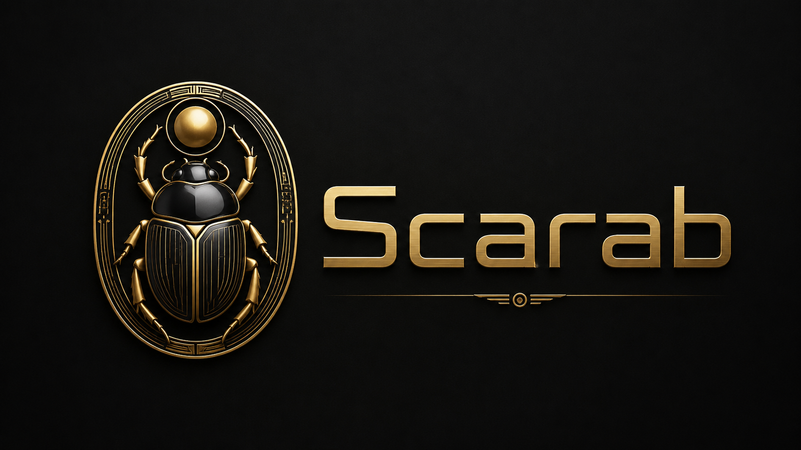

<p align="center">
  
</p>

<p align="center">
  <strong>Asset catalog generator for MechWarrior 5: Mercenaries.</strong>
</p>

<p align="center">
  <a href="https://github.com/FiendishDrWu/Scarab/releases/latest">Latest release</a>
  ·
  <a href="https://github.com/FiendishDrWu/Scarab/issues">Report a problem</a>
  ·
  <a href="https://github.com/FiendishDrWu/Scarab/issues">Request a feature</a>
</p>

---

# Scarab

Scarab is a standalone Windows utility that generates asset catalogs for [JJ's MechWarrior 5: Mercenaries Save Editor](https://github.com/jonayetjubaer-cmyk/JJs-MW5-Merc-Save-Editor), mod developers, or anyone else that has an interest in Mechwarrior 5 asset data.

It reads a local MechWarrior 5: Mercenaries installation, discovers the base-game assets and mods enabled by the game, and generates catalogs describing available items, mechs, stock mech templates, and traits. Stock mech templates also include chassis maximum armor values derived from the game assets.

Scarab is designed primarily as a catalog-generation backend for save game editors like JJ's MW5 Save Editor. It may also be run directly.

## Download

Download the current release from the **[Latest Scarab release](https://github.com/FiendishDrWu/Scarab/releases/latest)**.

For the executable directly:

**[Download scarab.exe](https://github.com/FiendishDrWu/Scarab/releases/latest/download/scarab.exe)**

Scarab is distributed as a standalone Windows x64 executable. No installer is required.

The release contains three Scarab publication assets:

- `scarab.exe`
- `scarab.exe.sha256`
- `scarab.exe.virustotal.json`

Download `scarab.exe` to a location where it is allowed to create its output directory.

> [!NOTE]
> JJ's MW5 Save Editor users should use the Scarab release specifically supported by the editor. Scarab and JJ's editor may release on different schedules, so the newest Scarab release is not automatically the correct backend for every editor build.

> [!NOTE]
> JJ's MW5 SAVE EDITOR USERS DO NOT NEED TO READ ANY FURTHER. The save editor handles all of the Scarab commands for you behind the scenes.

## Usage

Run Scarab from PowerShell, Command Prompt, or another program that launches executables.

Basic usage:

```powershell
.\scarab.exe --mw5-dir <MW5 game directory> --output <relative output directory>
```

Example:

```powershell
.\scarab.exe --mw5-dir "D:\MW5 Mercs\MW5Mercs" --output jj-catalog
```

Scarab discovers the base-game pak and Mods directory from the supplied MW5 game directory.

`--output` must be a relative path. The generated output directory is created relative to the directory containing `scarab.exe`.

### Command options

```text
--mw5-dir <MW5_DIR>
--output <OUTPUT>
--catalog-input-dir <CATALOG_INPUT_DIR>
--exclude-base-game
--exclude-mods
--exclude-mod <EXCLUDED_MOD_FOLDERS>
--catalog-format <CATALOG_FORMAT>
--build-report
--overwrite-input-catalogs
```

Catalog formats:

```text
json-gz
python
json
```

The default catalog format is `json-gz`.

### Examples

Generate the default compressed JSON catalogs from the base game and enabled mods:

```powershell
.\scarab.exe --mw5-dir "D:\MW5 Mercs\MW5Mercs" --output jj-catalog
```

Use a trusted catalog bundle as the base layer and merge enabled mods over it:

```powershell
.\scarab.exe --mw5-dir "D:\MW5 Mercs\MW5Mercs" --catalog-input-dir "D:\JJ Editor\catalogs" --output generated-catalog
```

Generate the default catalog bundle and include a diagnostic build report:

```powershell
.\scarab.exe --mw5-dir "D:\MW5 Mercs\MW5Mercs" --output diagnostic-catalog --build-report
```

Generate Python-compatible catalogs:

```powershell
.\scarab.exe --mw5-dir "D:\MW5 Mercs\MW5Mercs" --output python-catalog --catalog-format python
```

Generate plain JSON catalogs using only the base game:

```powershell
.\scarab.exe --mw5-dir "D:\MW5 Mercs\MW5Mercs" --output base-json --exclude-mods --catalog-format json
```

Generate catalogs using enabled mods but excluding the base game:

```powershell
.\scarab.exe --mw5-dir "D:\MW5 Mercs\MW5Mercs" --output mods-only --exclude-base-game
```

Exclude one or more specific enabled mod folders:

```powershell
.\scarab.exe --mw5-dir "D:\MW5 Mercs\MW5Mercs" --output filtered --exclude-mod SomeModFolder --exclude-mod AnotherModFolder
```

## Generated files

The default `json-gz` format generates:

```text
item_catalog.json.gz
mech_catalog.json.gz
trait_catalog.json.gz
stock_templates.json.gz
```

Scarab always generates the complete catalog set.

The diagnostic build report is off by default. Add:

```text
--build-report
```

to also generate:

```text
catalog_build_report.json
```

### Python output

With:

```text
--catalog-format python
```

the item, mech, and trait catalog files become:

```text
item_catalog.py
mech_catalog.py
trait_catalog.py
```

`stock_templates.json.gz` remains compressed JSON.

### Plain JSON output

With:

```text
--catalog-format json
```

the item, mech, and trait catalog files become:

```text
item_catalog.json
mech_catalog.json
trait_catalog.json
```

`stock_templates.json.gz` remains compressed JSON.

## Trusted catalog base-layer input

Scarab may use an existing trusted catalog bundle as the base catalog layer instead of rescanning the MW5 base-game pak.

Use:

```text
--catalog-input-dir <catalog directory>
```

The catalog directory must provide:

```text
item_catalog.json.gz
mech_catalog.json.gz
trait_catalog.json.gz
stock_templates.json.gz
```

For the item, mech, and trait catalogs, Scarab also accepts the equivalent plain `.json` file when the preferred `.json.gz` file is absent.

`stock_templates.json.gz` is required.

When `--catalog-input-dir` is supplied:

1. Scarab loads the trusted catalog bundle as the base layer.
2. Scarab does not scan the base-game pak for a second base layer.
3. Enabled mods are still discovered from MW5's configuration.
4. Enabled mod paks are still scanned in merge order.
5. Mod-derived data is merged over the supplied base catalog layer using Scarab's normal precedence behavior.

`--catalog-input-dir` cannot be combined with `--exclude-base-game`. The catalog input already supplies the base layer, so Scarab rejects that contradictory combination.

The catalog input directory is not an extracted-asset import mechanism and does not replace MW5's enabled-mod configuration.

## Input catalog overwrite protection

By default, Scarab refuses to use the same resolved directory for both `--catalog-input-dir` and `--output`.

This protects trusted base catalogs from accidental replacement.

Use a separate output directory for normal operation.

Same-directory output is allowed only when the caller explicitly supplies:

```text
--overwrite-input-catalogs
```

That flag applies only to the catalog-input/output same-directory safety check. It is not a general force or overwrite option.

Even with the override, Scarab loads and validates the complete input catalog bundle before writing replacement output.

## Base-game and mod discovery

Without `--catalog-input-dir`, Scarab includes the MW5 base-game pak unless `--exclude-base-game` is supplied.

Scarab includes mods unless `--exclude-mods` is supplied.

For mods, Scarab reads MW5's `modlist.json` and includes only mods the game currently marks as enabled.

For each included mod, Scarab reads its `mod.json` load order and scans mod paks in merge order.

Specific enabled mods may be subtracted with:

```text
--exclude-mod <folder>
```

This option does not create a separate caller-defined mod list. It only excludes matching folders from the set already enabled by MW5.

Use:

```text
--exclude-mods
```

to ignore all mods.

Use:

```text
--exclude-base-game
```

to omit the base-game pak when no catalog input directory is being used.

Scarab reads game and mod data only. It does not modify MW5 game files, mod files, `modlist.json`, or mod configuration.

Scarab does not maintain a catalog cache or persistent application state.

## Verifying a Scarab release

Scarab is closed-source software. Because users cannot independently audit the source code, Scarab releases are published with multiple forms of integrity and provenance information.

### Authenticode signature

`scarab.exe` is Authenticode signed and RFC 3161 timestamped.

Windows users can inspect the signature from the executable's Properties dialog under **Digital Signatures**.

PowerShell may also be used:

```powershell
Get-AuthenticodeSignature .\scarab.exe |
    Format-List Status, StatusMessage, SignerCertificate, TimeStamperCertificate
```

With normal certificate trust and revocation checks available, the release executable should report a valid signature.

### SHA-256 checksum

Every release includes:

```text
scarab.exe.sha256
```

Calculate the downloaded executable's SHA-256 hash with:

```powershell
Get-FileHash .\scarab.exe -Algorithm SHA256
```

The resulting hash must exactly match the digest recorded in `scarab.exe.sha256` and on the GitHub Release.

### VirusTotal release manifest

Every release includes:

```text
scarab.exe.virustotal.json
```

This records the completed VirusTotal release-time analysis associated with the exact SHA-256 of the published executable.

Scarab's release process requires:

```text
0 malicious
0 suspicious
```

before publication.

The manifest also contains the exact VirusTotal report URL for the signed executable.

A VirusTotal result is not a guarantee that software is malware-free. It is published as additional release-time evidence tied to the same executable SHA-256 used throughout the release process.

### Immutable GitHub Release and attestation

Scarab releases are published as immutable GitHub Releases.

Before publication, the exact release assets are uploaded and their SHA-256 digests are validated. After publication, the release tag and assets are protected by GitHub's release immutability feature.

GitHub also provides a Sigstore release attestation containing the release identity and cryptographic digests of the published assets.

Together, the Authenticode signature, published SHA-256 checksum, VirusTotal release manifest, immutable GitHub Release, and GitHub release attestation provide multiple ways to verify that a downloaded executable matches the genuine published Scarab release.

## Closed-source status

Scarab is closed-source software.

This public repository is used for:

- official Scarab releases
- public documentation
- bug reports
- feature requests

The Scarab source code and private build repository are not published here.

GitHub automatically displays **Source code (zip)** and **Source code (tar.gz)** downloads for tagged releases. Those archives contain the contents of this public documentation and release repository. They are **not the Scarab application source code**.

## Reporting problems

Use the public repository's [Issues](https://github.com/FiendishDrWu/Scarab/issues) page to report Scarab problems.

When reporting a catalog-generation problem, include:

- Scarab version
- MW5 installation source, if relevant
- the command or options used
- a clear description of the unexpected result
- relevant console output
- `catalog_build_report.json` when useful and available

Because the build report is off by default, rerun the failing operation with `--build-report` when practical if the report may help diagnose the problem.

Do not upload copyrighted MW5 game assets or complete commercial game pak files to an issue.

For problems involving a specific mod, identify the mod and provide enough information to reproduce the problem without redistributing the mod author's files unless you have permission to do so.

## Feature requests

Feature requests may also be submitted through [Issues](https://github.com/FiendishDrWu/Scarab/issues).

Scarab is intentionally focused on generating asset catalogs for JJ's MechWarrior 5: Mercenaries Save Editor.

It is not intended to become a general pak explorer, asset browser, or standalone save editor.

---

Scarab is an independent community tool and is not part of JJ's MechWarrior 5: Mercenaries Save Editor.
