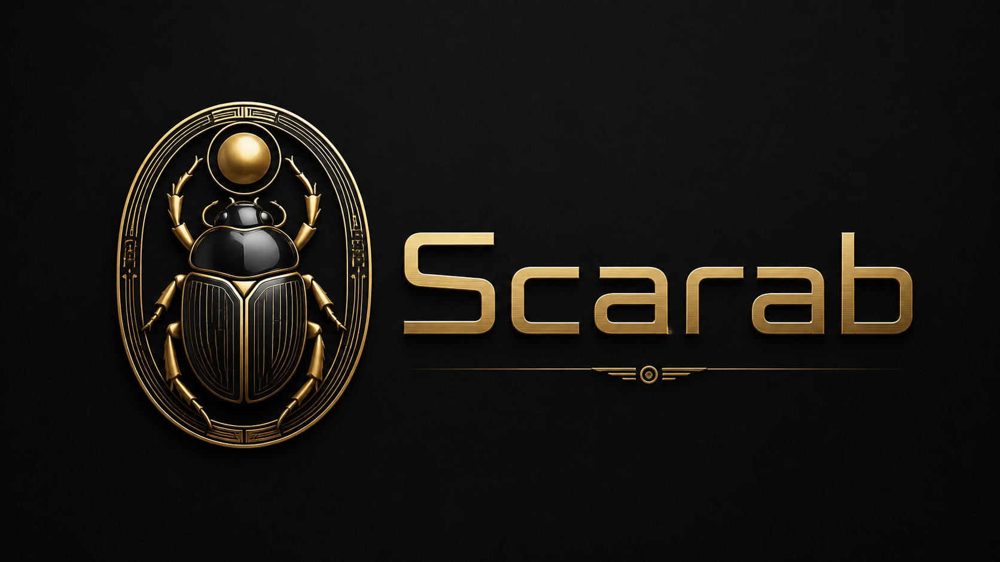

<p align="center">
  
</p>

<p align="center">
  <strong>Asset catalog generator for MechWarrior 5: Mercenaries.</strong>
</p>

<p align="center">
  <a href="https://github.com/FiendishDrWu/Scarab/releases/latest">Latest release</a>
  ·
  <a href="https://github.com/FiendishDrWu/Scarab/issues/new?template=bug_report.yml">Report a problem</a>
  ·
  <a href="https://github.com/FiendishDrWu/Scarab/issues/new?template=feature_request.yml">Request a feature</a>
</p>

---

# Scarab

Scarab is a standalone Windows asset catalog generator for MechWarrior 5:
Mercenaries. It reads a local MW5 installation and the mods enabled by the
game, then generates structured item, mech, stock-template, and trait catalogs
for save editors and other compatible tools.

[JJ's MechWarrior 5: Mercenaries Save
Editor](https://github.com/jonayetjubaer-cmyk/JJs-MW5-Merc-Save-Editor) is
Scarab's primary integration, but Scarab may also be run directly.

This repository contains the Scarab source code. Starting with v1.9.8, each
release tag retains the exact public source snapshot used to build that
published version.

## Scarab v1.9.8

Scarab v1.9.8 generates catalogs from the MW5 base game, manually installed
mods, and supported Steam Workshop installations. It can also use an existing
trusted catalog bundle as its base layer before merging enabled mods.

Scarab reads game and mod data only. It does not modify the MW5 installation,
mod files, `modlist.json`, or mod configuration, and it does not create a
persistent cache.

## Download

Download the current release from the **[Latest Scarab
release](https://github.com/FiendishDrWu/Scarab/releases/latest)**.

For the executable directly:

**[Download
scarab.exe](https://github.com/FiendishDrWu/Scarab/releases/latest/download/scarab.exe)**

Scarab is distributed as a standalone Windows x64 executable. No installer is
required. Each release contains:

- `scarab.exe`
- `scarab.exe.sha256`
- `scarab.exe.virustotal.json`
- `THIRD_PARTY_LICENSES.html`

`THIRD_PARTY_LICENSES.html` contains the dependency notices recorded in this
source tree together with the consolidated Rust standard-library notice from
the exact toolchain that built that executable.

Download `scarab.exe` to a location where it is allowed to create its output
directory.

> [!NOTE]
> JJ's MW5 Save Editor users normally do not need to run Scarab themselves,
> and should not need to read any further instructions.
> The editor handles the Scarab command and catalog paths automatically. Use
> the Scarab version supported by the editor rather than assuming the newest
> standalone release is compatible with every editor version.

## Usage

Run Scarab from PowerShell, Command Prompt, or another program that launches
executables.

Basic usage:

```powershell
.\scarab.exe --mw5-dir <MW5 game directory> --output <relative output directory>
```

Example:

```powershell
.\scarab.exe --mw5-dir "D:\MW5 Mercs\MW5Mercs" --output jj-catalog
```

`--output` must be relative. Scarab creates the output directory relative to
the folder containing `scarab.exe`.

### Command options

```text
--mw5-dir <MW5_DIR>
--output <OUTPUT>
--catalog-input-dir <CATALOG_INPUT_DIR>
--exclude-base-game
--exclude-mods
--exclude-mod <EXCLUDED_MOD_FOLDERS>
--catalog-format <CATALOG_FORMAT>
--build-report
--overwrite-input-catalogs
```

`--catalog-format` accepts `json-gz`, `json`, or `python`. The default is
`json-gz`.

`--exclude-mod <folder>` may be supplied more than once. It only subtracts
matching folder identifiers from the mods already enabled by MW5.

Use `.\scarab.exe --help` for the command's built-in help.

### Examples

Generate the default compressed JSON catalogs from the base game and enabled
mods:

```powershell
.\scarab.exe --mw5-dir "D:\MW5 Mercs\MW5Mercs" --output jj-catalog
```

Generate plain JSON catalogs using only the base game:

```powershell
.\scarab.exe --mw5-dir "D:\MW5 Mercs\MW5Mercs" --output base-json --exclude-mods --catalog-format json
```

Generate Python-compatible catalogs:

```powershell
.\scarab.exe --mw5-dir "D:\MW5 Mercs\MW5Mercs" --output python-catalog --catalog-format python
```

Use a trusted catalog bundle as the base layer, then merge enabled mods:

```powershell
.\scarab.exe --mw5-dir "D:\MW5 Mercs\MW5Mercs" --catalog-input-dir "D:\JJ Editor\catalogs" --output generated-catalog
```

Generate catalogs and a diagnostic build report:

```powershell
.\scarab.exe --mw5-dir "D:\MW5 Mercs\MW5Mercs" --output diagnostic-catalog --build-report
```

Generate catalogs from enabled mods without the base game:

```powershell
.\scarab.exe --mw5-dir "D:\MW5 Mercs\MW5Mercs" --output mods-only --exclude-base-game
```

Exclude specific enabled mod folders:

```powershell
.\scarab.exe --mw5-dir "D:\MW5 Mercs\MW5Mercs" --output filtered --exclude-mod SomeModFolder --exclude-mod AnotherModFolder
```

## Generated files

The default `json-gz` format generates:

```text
item_catalog.json.gz
mech_catalog.json.gz
trait_catalog.json.gz
stock_templates.json.gz
```

Scarab always generates the complete catalog set.

With `--catalog-format json`, the item, mech, and trait files become:

```text
item_catalog.json
mech_catalog.json
trait_catalog.json
```

With `--catalog-format python`, those three files become:

```text
item_catalog.py
mech_catalog.py
trait_catalog.py
```

`stock_templates.json.gz` remains compressed JSON in every format. Stock
templates retain their factory armor allocation and separately include
per-location chassis limits in `maxArmor` when those values are available from
the final mech data.

The diagnostic build report is off by default. Add `--build-report` to also
generate:

```text
catalog_build_report.json
```

## Trusted catalog base-layer input

`--catalog-input-dir <catalog directory>` uses an existing trusted catalog
bundle as the base layer instead of rescanning the MW5 base-game pak. The
directory must contain:

```text
item_catalog.json.gz
mech_catalog.json.gz
trait_catalog.json.gz
stock_templates.json.gz
```

For item, mech, and trait catalogs, Scarab also accepts the matching plain
`.json` file when the preferred `.json.gz` file is absent.
`stock_templates.json.gz` is always required.

With a catalog input directory:

1. Scarab loads and validates the bundle as the base layer.
2. Scarab does not scan the base-game pak for a second base layer.
3. Enabled mods are still discovered from MW5 and merged normally.

`--catalog-input-dir` cannot be combined with `--exclude-base-game`, because
the catalog bundle already supplies the base layer.

### Input catalog overwrite protection

Use a separate output directory for normal operation. By default, Scarab
refuses to use the same resolved directory for both `--catalog-input-dir` and
`--output`, protecting the trusted input bundle from accidental replacement.

Same-directory output is allowed only when the caller explicitly supplies:

```text
--overwrite-input-catalogs
```

This flag applies only to the input/output same-directory check. It is not a
general force option. Scarab loads and validates the complete input bundle
before writing replacement output.

## Base-game and mod discovery

Without `--catalog-input-dir`, Scarab includes the MW5 base-game pak unless
`--exclude-base-game` is supplied.

Scarab includes mods unless `--exclude-mods` is supplied. It reads
`MW5Mercs\Mods\modlist.json` and includes only entries the game currently marks
as enabled.

For manually installed mods, Scarab resolves each enabled folder beneath the
normal Mods directory:

```text
<MW5 installation>\MW5Mercs\Mods\<mod folder>
```

When the supplied MW5 path is inside a Steam library, Scarab also checks the
optional Workshop root:

```text
<Steam library>\steamapps\workshop\content\784080\<Workshop item ID>
```

The normal Mods directory is checked first. A missing Workshop directory is
normal and does not cause an error. Scarab does not use the Steam API or
require access to a Steam account.

For each included mod, Scarab reads `mod.json`, scans its pak files, and merges
its catalog data using the mod's load order.

## Yet Another Legendary Mech compatibility

Scarab includes reviewed catalog-presentation support for **Yet Another
Legendary Mech 3.6.8, build 1000**, including Steam Workshop item
`3048850100`.

For that exact version and build, Scarab corrects supported chassis grouping,
displayed tonnage association, and explicit Hero names. It does not change
variant or MDA identities, stock-template data, items, traits, load order, or
merge winners.

Other YALM versions are still scanned and merged normally without these
version-specific presentation adjustments. When `--build-report` is used, the
report records that the compatibility adjustment was skipped.

## Build from source

On Windows, install the current stable Rust toolchain, then run:

```powershell
git clone https://github.com/FiendishDrWu/Scarab.git
cd Scarab
cargo build --locked --release
```

The executable is written to:

```text
target\release\scarab.exe
```

## Verifying a Scarab release

Published Scarab executables are Authenticode signed and RFC 3161 timestamped.
Windows users can inspect the executable's **Digital Signatures** tab or run:

```powershell
Get-AuthenticodeSignature .\scarab.exe |
    Format-List Status, StatusMessage, SignerCertificate, TimeStamperCertificate
```

With normal certificate trust and revocation checks available, the signature
should report `Valid`.

Every release includes `scarab.exe.sha256`. Calculate the downloaded
executable's SHA-256:

```powershell
Get-FileHash .\scarab.exe -Algorithm SHA256
```

The result must exactly match the digest in `scarab.exe.sha256` and on the
GitHub release.

Every release also includes `scarab.exe.virustotal.json`, which records the
completed release-time VirusTotal analysis, report URL, and exact executable
SHA-256. Publication requires the analysis to report:

```text
0 malicious
0 suspicious
```

A VirusTotal result is additional release-time evidence, not a guarantee that
software is malware-free.

Scarab releases are published as immutable GitHub Releases. The release tag
resolves to the exact public source commit used for the build, and GitHub
protects the published tag and assets from later replacement. GitHub also
provides a release attestation containing the release identity and
cryptographic asset digests.

## Reporting problems

Use the **[bug report
form](https://github.com/FiendishDrWu/Scarab/issues/new?template=bug_report.yml)**
for reproducible Scarab problems.

Include the Scarab version, MW5 installation source, command or options used,
relevant mod names and versions, expected result, actual result, and useful
console output. If practical, rerun with `--build-report` and attach
`catalog_build_report.json`.

Do not upload copyrighted MW5 game assets, complete commercial game pak files,
or third-party mod files you do not have permission to redistribute.

## Feature requests

Use the **[feature request
form](https://github.com/FiendishDrWu/Scarab/issues/new?template=feature_request.yml)**
for focused improvements to MW5 catalog generation or compatible integrations.

Scarab is not intended to become a general pak explorer, asset browser, mod
manager, or standalone save editor.

## Security

Do not disclose suspected security vulnerabilities in a public issue. Follow
the private reporting instructions in [SECURITY.md](SECURITY.md).

## License

Scarab is licensed under the [MIT License](LICENSE).

Scarab uses permissively licensed third-party software. Copyright and license
notices for the exact locked dependency set and incorporated JJ editor helpers
are collected in [THIRD_PARTY_LICENSES.txt](THIRD_PARTY_LICENSES.txt).
Published executable releases include those notices and the exact build
toolchain's Rust standard-library notices in `THIRD_PARTY_LICENSES.html`.

Scarab's original branding artwork is copyright © 2026 FiendishDrWu and is
distributed under the same MIT License.

---

Scarab is an independent community tool and is not part of JJ's MechWarrior 5:
Mercenaries Save Editor.
